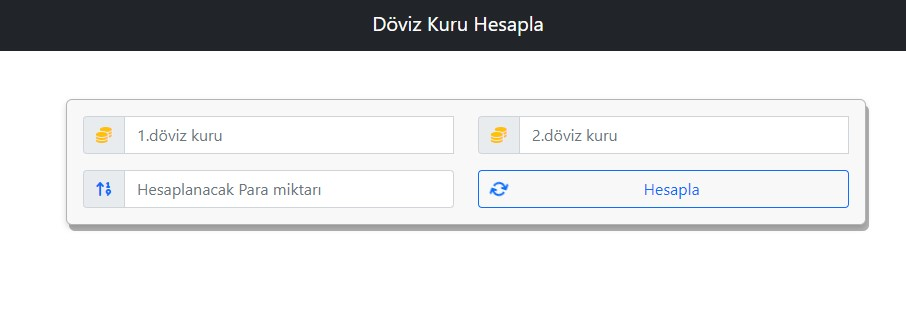

# Döviz Kuru Uygulaması 

Bu projemde güncel döviz kuru uygulaması yaptım istediğimiz ülkenin parasını istediğimiz para birimine dönüştürebililoruz.  Uygulama apisini *https://app.exchangerate-api.com/sign-in/retry* sitesinden alındı. 



Uygulama tasarımında 1.döviz kuru alanına çevirmek istediğiniz para birimini 2.döviz kuru alanında hangi para birimine çevirmek istiyorsanız o ülkenin para birimini seçiyorsunuz. Aşağıdaki resimde 1 USD kaç TRY olduğuna bakılıyor.


## Döviz Kuru Tasarımı

Bu uygulamayı yaparken bootsrap kütüphanesinden yararlanıldı. Nav tag'ıiçinde container classı altında Döviz Kuru Hesapla başlığı tanımlandın. 

```html
<nav class="navbar navbar-dark bg-dark text-center">

        <div class="container justify-content-center">
            <a href="" class="navbar-brand">Döviz Kuru Hesapla</a>

        </div>
     </nav>
```

Nav tag'ını kapatıktan sonra yeni bir div etiketi içinde container classı açıyoruz. Bu container içinde uygulama tasarımı yer almaktadır. Containerın genişliğini 800px olarak ayarıyoruz. Containerın hemen altında 2 tane  row classı oluşturuyoruz, row claslarının altında da 2 tane colon oluşturup bu colonlar içine input taglarını ekliyoruz.  Bu inputllar içine kullanıcı sorgulamak istediği para birimi değerlerini girecek. İnputlarin içinede select özeliğini ekliyoruz<datalist id="one_list"> </datalist> bu kod içine javascript ile ülkelerin para birim, değerlerini göndereceğiz. 

```html
  <div class="container mt-5 denım " style="width: 800px;">

        <div class="row">
            <div class="col input-group">
          <span class="input-group-text"><i class="fa-solid fa-coins text-warning"></i></span>
              <input type="text" class="form-control" id="oneValue"  list="one_list" placeholder="1.döviz kuru">
              <datalist id="one_list"> </datalist>
            </div>
            <div class="col input-group">
              <span class="input-group-text"><i class="fa-solid fa-coins text-warning"></i></span> 
              <input type="text" class="form-control" id="twoValue" placeholder="2.döviz kuru" list="two_list">
              <datalist id="two_list"> </datalist>
            </div>

        </div>
```

Diğer row altında da 2 tane colon oluşturuyoruz. İlk kolona  bir tane input tagı ekliyoruz. Kullanıcı bu input tagı içine sorgulatmak istediği para birimi miktarını girecek. İkinci colon içine  button  ekliyoruz kullanıcı bu butona tıkladığında sorgulama işlemini gerçekleşitirecek. Butonun içine de spin ikonu ekliyoruz. Bu ikon ile kullanıcıya çevirme işleminin gerçekleştiğini gösteriyoruz.

```html
 <div class="row ">
            <div class="col input-group">
                  <span class="input-group-text  mt-3"> <i class="fas fa-sort-numeric-up text-primary"></i></span>  
                <input type="number" id="moneyAmount" class="form-control mt-3" placeholder="Hesaplanacak Para miktarı">
            </div>
            <div class="col input-group">
                <button class="btn btn-outline-primary mt-3 w-100" id="exchangeCalculate"> <i class="fa fa-refresh fa-spin text-outline-primary float-start mt-1 "></i>Hesapla</button>
    
            </div>
  
        </div>

```

Kullanıcı sorgulama işlemi yaparken bir kaç saniye bekleme işlemi gerçekleşmekte bunuda kullanıcıya göstermek için loading spinerı oluşturdum. Kullanıcı butona tıkladıktan sonra  row classının hemen altında sonuç getirene kadar kullanıcıya gözükecek. Sonuç ekrana geldiğinde loading spini ekrandan kaybolacak.


Kullanıcı döviz kurunu hesaplatırken bir kaç saniyelik bekleme süresi gerçekleşmektedir. Bu bekleme süresini kullanıcıya göstermek için loading spinerı oluşturuyoruz. Kullanıcı hesapla butonuna tıkladıktan sonra sonuç gelene kadar hesapla butonun altında loading spiner'ı kullanıcıya gösterilecek. Sonuç ekrana geldiğinde loading spinerı kaybolacak.


```html
   <div id="resultValue">

            <!-- <div class="card border-primary shadow mt-3">
                <div class="card-body text-center" style="font-size:16px">
                100$ = 1745 TL
                </div>
            </div> -->

        </div>

        <div id="resultValue2"></div>
     </div>

```

Sonuç bir sonuç alanı daha oluşturdum bu alan altında  altında sorgulatılan para biriminin diğer ülkelerdeki değeri karşımıza gelecek. Örneğin 1 Euro'yu TRY çeviriyoruz. Bu sonuç altında 1 Euro'nun diğer ülkelerdeki oranı karşımız gelecek.


## Döviz Kuru JavaScript Kodları;

Javascript kodlarını yazarken ilk önce *https://app.exchangerate-api.com/sign-in/retry*  sitesinden Url ve kişiye özel Apı bilgisini alıyoruz.


Yukarıdaki resimde ExhangeRate-Api sayfasından aldığımız apıleri kullanmak için değişkenlere atıyoruz. 

```javascript

const oneValue= document.getElementById("oneValue");
const twoValue = document.getElementById("twoValue")
const oneList = document.getElementById("one_list")
const twoList = document.getElementById("two_list")
const moneyAmount = document.getElementById("moneyAmount")
const exchangeCalculate = document.getElementById("exchangeCalculate")
const resultValue = document.getElementById("resultValue")
const resultValue2 = document.getElementById("resultValue2")
```

Yukarıdaki kodları tasarım alanında oluşturduğumuz input, button ve divlerin id bilgilerini alıyoruz ve hepsini oluşturulan değişkenler içine atıyoruz.. 

Döviz kuru'nu  hesaplamak için async-await fonksiyonu oluşturuyoruz. Bu fonksiyon içerisinde de ilk önce ExchangeRate-Api sayfasından aldığımız url  bilgisini fetch ediyoruz ve bunu response değişkeni içerisine atıyoruz. Response değişkeni içerisindeki veriyi de json çevirerek data değişkenine atıyoruz.

```javascript
async function showMoney(){
    document.querySelector("#load").style.display = "none"
    try{
        const response = await fetch(url + "/codes");
        console.log(response)
        const data = await response.json();
        console.log(data)
```


Kırmızı okla gösterilen alanda fetch ettiğimiz url bilgisi yer almaktadır. Mavi okla gösterilen yerde ise json' çevirip data değişkeni içerisine attığımız veriler yer almaktadır. Biz bu veriler üzerinden işlemlerimizi yapıyoruz. 

Json işleminden sonra items diye bir değişken oluşturuyoruz bu değişken içerisine data.supported_codes yazarak supported_codes içerindeki verileri alıp items değikeşkeni içine atıyoruz.


```javascript
const items = await data.supported_codes;
        console.log(items)
```

İtems değişkenini ekrana yazdırdığımızda şöyle bir sonuç gelecek ekranımıza; 

let options; diye bir seçenek değişkeni oluşturuyoruz. for of döngüsü kullanarak items içindeki verileri exchange değişkeni içerisine aktarıyoruz. Yinelenebilir nesneler arasında bir döngü oluşturuyoruz.  Options değişkeni içerisine   <option value = ${exchange[0]}> ${exchange[1]}</option>` diyerek bir tane seçenek listesi oluşturuyoruz. Bu seçenek bize ülkelerin para birimini *exchange[0]* ve ülkenin *exchange[1]* adını gösterecek.

```javascript
 let options;

        for(let exchange of items){
            options += `
            <option value = ${exchange[0]}> ${exchange[1]}</option>`

            oneList.innerHTML = options;
            twoList.innerHTML = options
        }

```

Oluşturmuş olduğumuz bu seçenek listesini de one_list ve two_list'eleri içine atıyoruz.

```javascript
const oneList = document.getElementById("one_list")
 <datalist id="one_list"> </datalist>
const twoList = document.getElementById("two_list")
 <datalist id="two_list"> </datalist>
```

İnputlar içine tıkladığımızda bize şöyle bir seçenek listesi dönecek.


Oluşturduğumuz seçenek listeleri ile kolaylıkla isteğimiz ülkenin para birimini bulabiliriz.

Hesapla butonuna tıkladığımızda input alanlarına girilen verilerin sonuçlarını döndürmek için hesapla butonuna **const exchangeCalculate = document.getElementById("exchangeCalculate")** bir tene event olayı vermeliyiz ki butona tıkladığımızda oluşturacağımız fonksiyın gerçekleşsin. 

Butona tıkladığımızda 

- 1.döviz kuru alanına girdiğimiz değeri exchange1 değişkeni içerisine atıyoruz. 

  ```javascript
     <input type="text" class="form-control" id="oneValue"  list="one_list" placeholder="1.döviz kuru">
         const oneValue= document.getElementById("oneValue");
  const exchange1 = oneValue.value;
  
  ```

- 2.döviz kuru alanına girdiğimiz değeri exhange2 değişkeni içerisine atıyoruz.

  ```javascript
  <input type="text" class="form-control" id="twoValueplaceholder="2.döviz kuru" list="two_list">
        const twoValue = document.getElementById("twoValue")
      const exchange2 = twoValue.value;
  ```

- moneyAmount alanına hesaplatmak istediğimiz para miktarını  giriyoruz ve bunu da amount değişkeni içerisine atıyoruz.

  ```javascript
   <input type="number" id="moneyAmount" class="form-control mt-3" placeholder="Hesaplanacak Para miktarı">
       const moneyAmount = document.getElementById("moneyAmount")
      const  amount = moneyAmount.value;
  ```

showExhange diye async-await fonksiyonu oluşturuyoruz. Bu fonksiyon içerisinde de resp diye bir değişken tanımlıyoruz  bu değişken içerisine  **fetch(url + "/latest/" + exchange1)** url'nin sonuna 1.döviz kuru alanından gelen ülkenin para birimi değerini aktarıp bunu fetch adiyoruz. Bu değişkeni json() veriye çevirip data değişkeni içerisine aktarıyoruz.


Kahverengi okla gösterilen alan resp değişkeni içerisnde fetch edilen url bilgisi yer almaktadır. Mavi okla gösterilen alanda ise data değişkeni içiresinde json() veriye çevirilen veri yer almaktadır.

```javascript
   async function showExchange(){
        const resp = await fetch(url + "/latest/" + exchange1)
        console.log(resp)
        const data = await resp.json();
        console.log(data);

        const outpot = data.conversion_rates;

        console.log(outpot)
```

Data içinde concersion-rates alanını alıp oluşturmuş olduğumuz outpot değişkeni içerisine atıyoruz.


Data içerisinden almış olduğumuz  conversion_rates verisinin içinden exchange2 değişkeni içerisine girilen para birimini alıp amount (miktarla) çarpıyoruz toFixed() fonksiyonu ile noktadan sonra sadece 2 basamağı alıyoruz. Result değişkeni içerisine atıyoruz. Bu değiken içerisine attığımız veri işlem sonucunu döndürecek.


Bu sonucu ekrana yazdırmak için valueResult adında bir değişken oluşturuyoruz. Bu değişken içerisinde div etiketi altında card classı oluşturarak dönecek olan sonucu card-body içinde  tanımlıyoruz. Bu değişken içerisinde bana ilk önce girilen miktar bilgisi miktar bilgisinin yanında hangi kur üzerinden çevirim yapılacağı yer alıyor, eşşittirin  sol tarafında ise bana sonuc bilgisi gelecek sonuc bilgisinin yanında hangi döviz kuruna çevirme işlemi yaptıysam o ülkenin para birimi kısaltması gelecek. valueResult değişkenini de  **resultValue.innerHTML = valueResult**  resultValue içerisine atıyoruz. Aşağıdaki resimde sonuç ekranda oklarla gösterilmiştir.

 

```javascript
 let valueResult;
        valueResult = `
        <div class="card border-primary shadow mt-2" >
            <div class="card-body text-center " style=" font-size:24px; font-weight:bold;">
            ${amount} ${exchange1} = ${result} ${exchange2}
            </div>
        
        </div>
        `
   resultValue.innerHTML = valueResult

```


Sonucun altında kırmızı oklarla gösterilen alan  bana diğer ülkelerin 1 USD karşılığındaki değerlerini getirecek.


Bu alanı oluşturmak için outpot diye bir değişken oluşturuyoruz bu değişken içerisine data içerisindeki conversion_rates verisini atıyoruz. For in döngüsü ile bir döngü oluşturuyoruz outpot içindeki verileri otherExchange değişkeni içersine ekliyoruz. For in döngüsüyle yapmak istediğimiz nesne içerisindeki verilere ulaşarak bunların değerleri üzerinde işlem yapmak.

```javascript
const outpot = data.conversion_rates;

        console.log(outpot)
        
 for(let otherExchange in outpot){
	 console.log(otherExchange, outpot[otherExchange])

```


İstedğimiz sonuçları yukarıdaki resimdeli gibi gelecektir. Biz bu fonksiyon ile key ve value değerileri üzerinden işlem yapabileceğiz.

```html javascript
  <div id="resultValue2"></div>
 </div>
```

resultValue2 değişkeni içerisine div etiketi altında card classı oluşturduk. Card altında da ul etiketi içinde li elemanları oluşturarak  otherExhange içerisine attığımız değerleri liste haline ekrana yazdıracağız.

```javascript
  const resultValue2 = document.getElementById("resultValue2")
  
  resultValue2.innerHTML += `
    <div class =  " card border-primary d-inline-flex ava mt-2"> 
    <ul style="list-style-type:none" class="list-group list-group-horizontal d-inline-flex">
      <li class="list-group-item float-end">
      ${otherExchange}:${outpot[otherExchange]}
      </li>

    </ul>
    </div>
    
    `
```

li tag'leri içinde *otherExchange* ile ülkenin para birimini, *outpot[otherExchange]* ile de  dönderilen döviz kuru oranını alıyoruz.

Sonuç altında diğer ülkelerin döviz kuru oranlarını kullanıcıya gösterildikten sonra belli bir saniye sonra kalkmasını isiyoruz bunu setTimeout fonksiyonu ekleyerek gerçekleştirdik. ResulValue2 değişkeni içerisindeki bilgi kullanıcıya 10 saniye gösterilecek 10 saniye sonunda ekrandan kaldırılacak.

```javascript
setTimeout(()=>{
        document.getElementById("resultValue2").remove()
    },10000)
```

